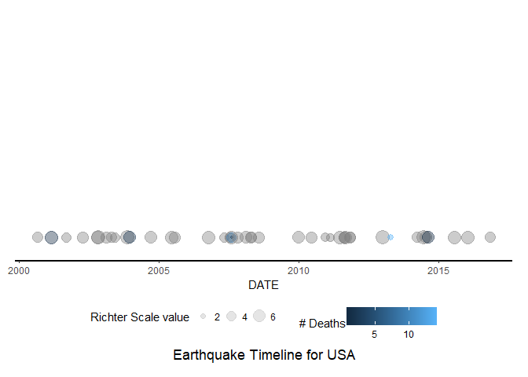
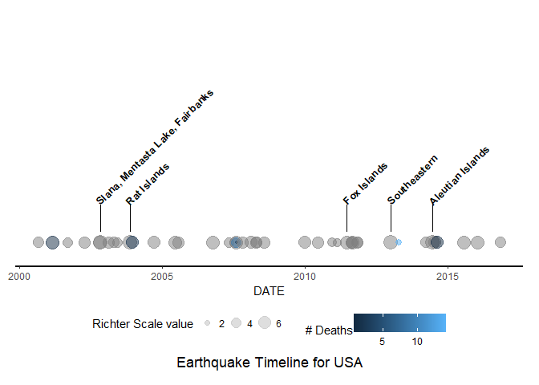
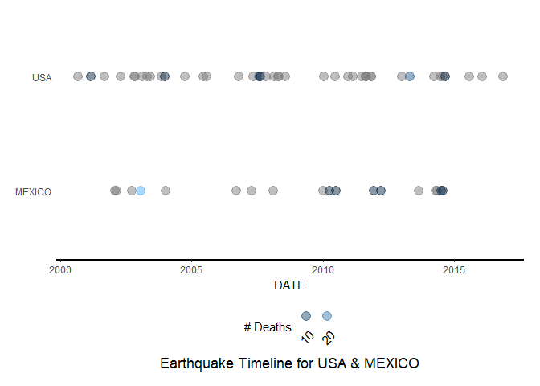
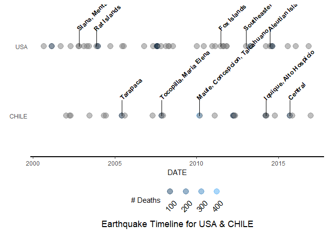
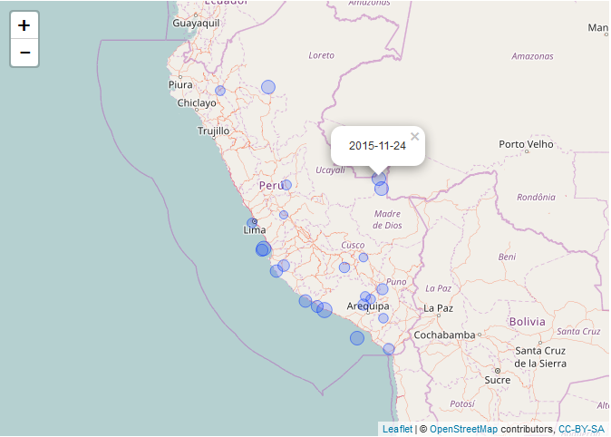
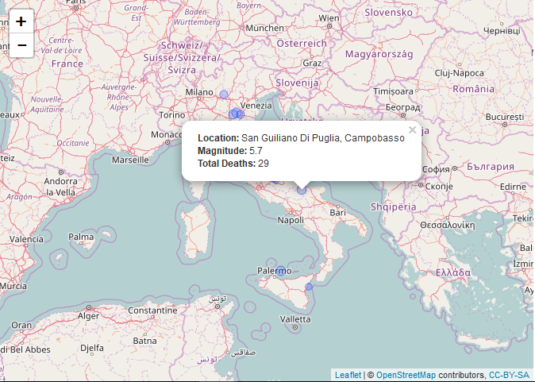

# NOAAA
R Package for analysing Significant Earthquake Database in National Centers for Environmental Information

08/10/2017

[](https://travis-ci.org/shubh-b/NOAAA)


## Installation

Use the devtools package:


```r
library(devtools)
install_github("shubh-b/NOAAA")
library(NOAAA)
```

## Functions

This package includes the following functions

* eq_data_read
* eq_clean_data
* eq_create_label
* eq_location_clean
* eq_map
* geom_timeline
* geom_timeline_label
* eq_time

## Usage

### Data loading and cleaning


```r
library(ggplot2)
library(ggmap)
library(leaflet)
library(lubridate)
library(dplyr)
library(readr)
library(stringr)

library(ykvdpcap)
data<-system.file('extdata','data.gz', package = 'NOAAA')

eq_data <- eq_data_read(data)
head(eq_data[,1:7])
```

```
## # A tibble: 6 x 7
##     I_D FLAG_TSUNAMI  YEAR MONTH   DAY  HOUR MINUTE
##   <int>        <chr> <int> <int> <int> <int>  <int>
## 1     1         <NA> -2150    NA    NA    NA     NA
## 2     3         <NA> -2000    NA    NA    NA     NA
## 3     2          Tsu -2000    NA    NA    NA     NA
## 4  5877          Tsu -1610    NA    NA    NA     NA
## 5     8         <NA> -1566    NA    NA    NA     NA
## 6    11         <NA> -1450    NA    NA    NA     NA
```

```r
eq_clean <- eq_data %>% eq_clean_data()
head(eq_clean[,1:7])
```

```
## # A tibble: 6 x 7
##     I_D FLAG_TSUNAMI       DATE  HOUR MINUTE SECOND FOCAL_DEPTH
##   <int>        <chr>     <date> <int>  <int>  <chr>       <int>
## 1    38         <NA> 0010-01-01    NA     NA                 18
## 2    39         <NA> 0011-01-01    NA     NA                 NA
## 3    40         <NA> 0017-01-01    NA     NA   <NA>          NA
## 4    41         <NA> 0023-01-01    NA     NA                 NA
## 5    42         <NA> 0025-01-01    NA     NA                 NA
## 6    43         <NA> 0027-01-01    NA     NA                 NA
```

### Time Line


```r
eq_clean %>%
dplyr::filter(COUNTRY == "USA" & lubridate::year(DATE) >= 2000) %>%
eq_time(size="EQ_PRIMARY",color="DEATHS")
```

<!-- -->

### With Location Names

```r
eq_clean %>%
dplyr::filter(COUNTRY == "USA" & lubridate::year(DATE) >= 2000) %>%
eq_time(size="EQ_PRIMARY",color="DEATHS",alpha=0.5,timeline_label=TRUE)
```

<!-- -->

### 2 Countries


```r
eq_clean %>%
dplyr::filter((COUNTRY=="USA" | COUNTRY=="MEXICO") & lubridate::year(DATE) >= 2000) %>%
eq_time(y="COUNTRY",color="DEATHS",alpha=0.5)
```

<!-- -->

### 2 Countries With Location Names


```r
eq_clean %>%
dplyr::filter((COUNTRY=="USA" | COUNTRY=="CHILE") & lubridate::year(DATE) >= 2000) %>%
eq_time(y="COUNTRY",color="DEATHS",alpha=0.5,timeline_label=TRUE)
```

<!-- -->

### Interactive Map


```r
eq_clean %>%
dplyr::filter(COUNTRY == "PERU" & lubridate::year(DATE) >= 2000) %>%
eq_map(annot_col = "DATE")
```

<!-- -->

### Interactive Map with automated popup text


```r
eq_clean %>%
dplyr::filter(COUNTRY == "ITALY" & lubridate::year(DATE) >= 2000) %>%
dplyr::mutate(popup_text = eq_create_label(.)) %>%
eq_map(annot_col = "popup_text")
```

<!-- -->
